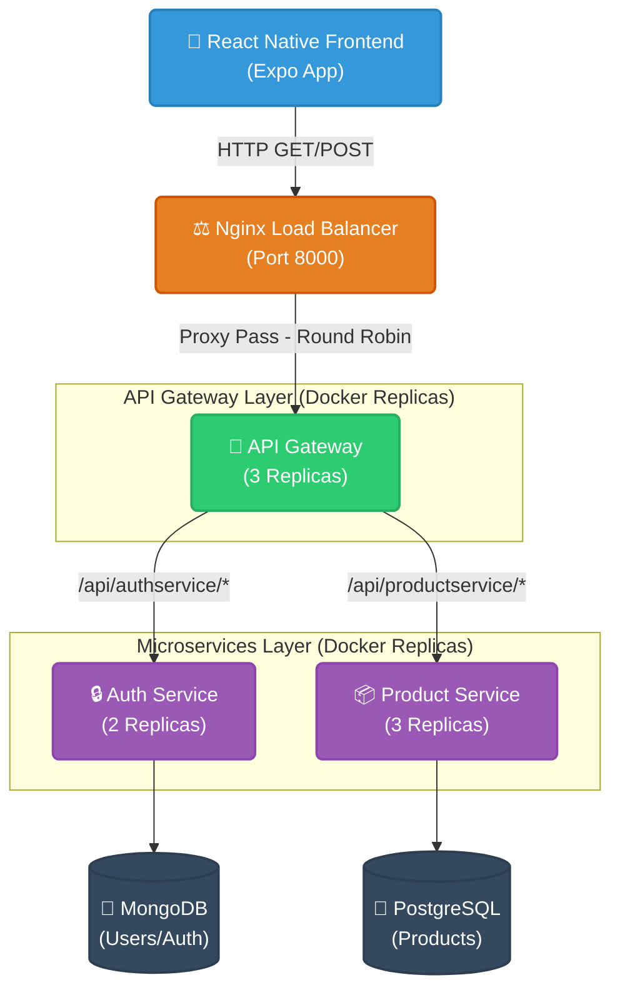

# Native API Testing Architecture

This repository contains a full-stack microservices architecture built with React Native (Expo) on the frontend and Express.js on the backend. The backend is completely containerized and orchestrated using Docker Compose, featuring an Nginx load balancer, an API Gateway layer, and independent microservices with automated replica scaling.

## 🏗️ Architecture Diagram

Here is a visual representation of how traffic flows through the system:



## 📂 Project Structure

- **`frontend/`**: The React Native application (Expo). Configured to send all API requests to the Nginx Load Balancer on port 8000.
- **`apigetway/`**: The core backend repository. Contains:
  - **`compose.yml`**: Docker Compose configuration that orchestrates Nginx, 3 API Gateways, 2 Auth Services, and 3 Product Services.
  - **`server.js`**: The Express application acting as the API Gateway. It uses `http-proxy-middleware` and relies on Docker DNS to automatically load balance requests to the microservices.
  - **`backend/`**: The Authentication Service (handles users, login, tokens) with its own Dockerfile.
  - **`product/`**: The Product Service (handles product data) with its own Dockerfile.
- **`nginx.conf`**: The configuration file for the Nginx Load Balancer, which acts as the entry point and distributes incoming traffic to the Gateway replicas.

## 🚀 Setup & Installation

### 1. Prerequisites
- [Node.js (v18+)](https://nodejs.org/)
- [Docker & Docker Compose](https://www.docker.com/)
- [Expo CLI](https://docs.expo.dev/)

### 2. Running the Backend Architecture (Docker)

The entire backend (Nginx, Gateways, Auth, Product) is containerized and managed by Docker Compose. You do not need to run Node manually for the backend!

```bash
cd apigetway
docker compose up -d --build
```
This will automatically:
- Build the API Gateway, Auth Service, and Product Service images.
- Spin up **1 Nginx Container** on Port `8000`.
- Spin up **3 API Gateway Containers**.
- Spin up **2 Auth Service Containers**.
- Spin up **3 Product Service Containers**.

*(To stop the architecture, simply run `docker compose down`)*.

### 3. Starting the Frontend

Make sure the frontend is installed, then start the Expo server:

```bash
cd frontend
npm install
npm run web
```
The frontend will start on port `8081` and automatically route all API requests to `http://localhost:8000`, perfectly hitting your Nginx load balancer!

## 🛠️ Testing the Load Balancer

You can use `autocannon` to verify that Nginx and the Docker DNS are successfully load balancing across your massive 8-container architecture:

```bash
npx autocannon -c 100 -d 10 http://localhost:8000/api/productservice/getproduct
```
This will send 100 concurrent requests for 10 seconds and output a performance benchmark.
