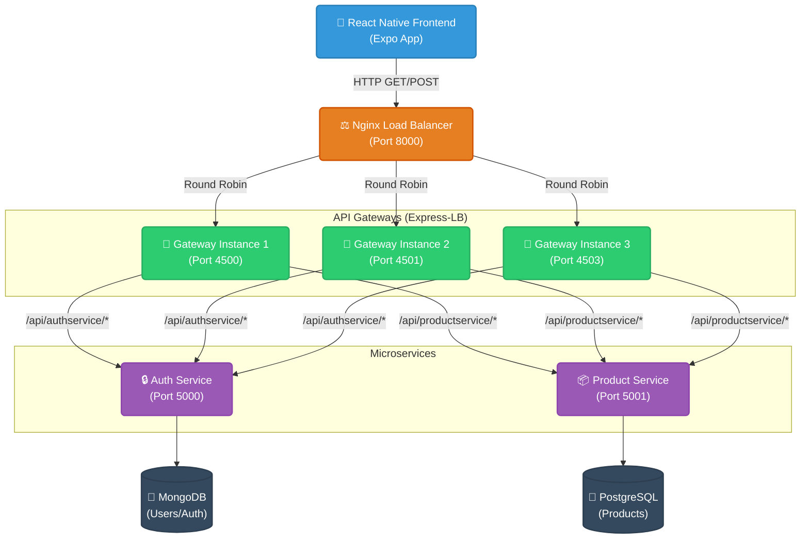

# Native API Testing Architecture

This repository contains a full-stack microservices architecture built with React Native (Expo) on the frontend and Express.js on the backend. The backend is orchestrated using an Nginx load balancer, an API Gateway, and multiple independent microservices.

## 🏗️ Architecture Diagram

Here is a visual representation of how traffic flows through the system:



## 📂 Project Structure

- **`frontend/`**: The React Native application (Expo). Configured to send all API requests to the Nginx Load Balancer.
- **`apigetway/`**: The core routing layer. Contains:
  - **`server.js`**: The Express application acting as the API Gateway. It uses `http-proxy-middleware` to forward requests to the specific microservices.
  - **`compose.yml`**: Docker Compose configuration that orchestrates multiple instances of the gateway and Nginx.
  - **`backend/`**: The Authentication Service (handles users, login, tokens).
  - **`product/`**: The Product Service (handles product data).
- **`nginx.conf`**: The configuration file for the Nginx Load Balancer, which distributes incoming traffic among the gateway instances.

## 🚀 Setup & Installation

### 1. Prerequisites
- [Node.js (v18+)](https://nodejs.org/)
- [Docker & Docker Compose](https://www.docker.com/)
- [Expo CLI](https://docs.expo.dev/)

### 2. Local Environment Setup

Each service requires environment variables. Make sure you have `.env` files created where necessary (e.g., in `frontend/`, `apigetway/backend/`, and `apigetway/product/`).

Install dependencies for all services:
```bash
# Frontend
cd frontend
npm install

# API Gateway
cd ../apigetway
npm install

# Auth Service
cd backend
npm install

# Product Service
cd ../product
npm install
```

### 3. Running with Docker Compose (Recommended)

To spin up the Nginx Load Balancer and multiple Gateway instances, run the following from the `apigetway` directory:

```bash
cd apigetway
docker compose up -d --build
```
This will:
- Build the `express-lb` Docker image.
- Start 3 Gateway containers (`app1`, `app2`, `app3`).
- Start the Nginx container, listening on port `8000`.

### 4. Running the Microservices Locally

Currently, the Auth and Product microservices are designed to be run via Node locally (while the Gateway/Nginx run in Docker).

```bash
cd apigetway
npm run dev
```
*(This uses `concurrently` to start the backend on port 5000 and the product service on port 5001).*

### 5. Starting the Frontend

```bash
cd frontend
npm run web
```
The frontend will start on port `8081` and automatically route API requests to `http://localhost:8000`, hitting your Nginx load balancer!

## 🛠️ Testing the Load Balancer

You can use `autocannon` to verify that Nginx is successfully load balancing across your gateway instances:

```bash
npx autocannon -c 100 -d 10 http://localhost:8000/api/productservice/getproduct
```
This will send 100 concurrent requests for 10 seconds and output a performance benchmark.
